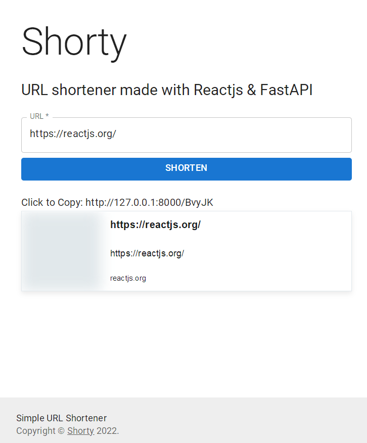

<h1 align="center">
    URL Shortener with ReactJS, FastAPI
</h1>

## 💻 Project Description

Simple URL shortener project built with ReactJS and FastAPI as a learing exercise.

### ✅ Demo

 <p align="center">
  
</p>

## 🚀 Powered By

### Frontend

-   ReactJS
-   Material UI
-   React Query
-   React Tiny Link
-   React Copy To Clipboard

### Backend

-   FastAPI
-   SqlAlchemy

### 📗 Installation (API & Web)

API backend:

```bash
$ cd backend
$ pip install -r requirements.txt
$ uvicorn src.main:app --reload
```

Web client:

```bash
$ cd client
2. $ npm install  # or yarn install
3. $ npm start    # or yarn start
```

### 📝 Author

Dr. Masroor Ehsan
